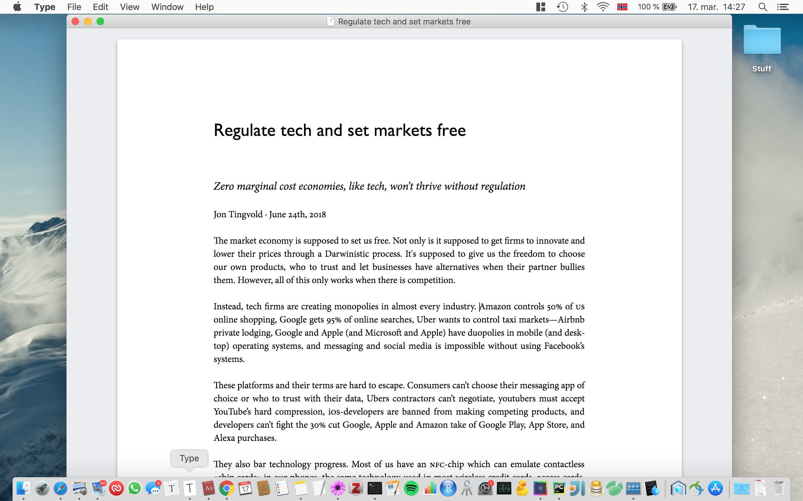

Type – A beautiful text processor
====

This is a small, personal software project created by Jon Tingvold in 2017. 

Type, is a simple and beautiful what-you-see-is-what-you-get (WYSIWYG) structured text processor with support for Mac and Windows (and probably Linux with some effort) build with Electron. 

Motivation
----------

I have often felt the world needs a better text processor. To be one of the most important applications in computers, they are depressingly bad. 

### Inherently ugly

The first problem is that most text processors are inherently ugly. Neither Word, Google Docs or browser makers have implemented quality text engines. They still lack proper justification of text, balanced headlines and many other typographic features that is common in professional text engines like Indesign or Latex. They usually lack quality fonts. And Word and Google Docs usually look quite ugly by default. If you want to improve the style of tables or whitespace around images, both (and even Apple Pages), requires you to set custom styles manually on each element—a tedious task.

### No semantic WYSIWYG-editor

My second annoyance is that you have to make a compromise between choosing semantic text formats like latex or markdown, and using easy to use what-you-see-is-what-you-get (WYSIWYG)-editors like Word and Google Docs. 

There are many reasons why you should use a semantic text format, where you define headers and image captions, instead of setting font sizes. It makes it easier to use well-designed templates, get a consistent design in long documents or change the design later. It makes it easy to export documents to other file formats and platforms. And in a world where we read more on screens than paper, it makes it possible to optimize the layout differently to small screens, big screens, and print. Additionally, your documents often look better because it's easier to manually control whitespace between elements, or bound images or tables to the top of pages or corners.

### No proper standardized document format

The third problem is that the world lacks a proper standardized document format. The Word file format is essentially proprietary and too complex for anyone to implement, not to mention the unsemantic file format. 

However, latex, markdown, and HTML are also not really suitable as document formats. Latex and HTML are too complex. Markdown is too simple and does not support image captions and image sizes, tables, small caps, and elements like kicker and lead. HTML and markdown do not have a consistent header hierarchy. An h2 element can be a subsection header in some documents and paragraph header in another, which makes it hard to export documents between systems. These problems are some of the the reason why "copy and paste" of rich text is so hard between applications. 

The biggest problem, however, is that neither of them is suitable for file formats for WYSIWYG-editors. As Medium developer Nich Santos [explained in a blog post](https://medium.engineering/why-contenteditable-is-terrible-122d8a40e480) in 2014, a WYSIWYG-editor needs a file format with a consistent, unambiguous mapping between content, selections, and edits. If not, it is hard to avoid strange errors and inconsistent layouts between editors.

## Project aim

The aim of the project was partially a study project to see how hard it was to solve some of these problems. 

Secondly, I wanted a better text processor myself. Mainly a structured WYSIWYG-editor that was clean and simple, that could export to other file formats and that had quality fonts and beautiful typography.

Goal
----

The goal of the project was to get a text processor with the following features:

- Structured text formatting
- WYSIWYG
- Quality fonts—not Google fonts
- Beautiful typography, with typographic features like small-caps and justification of text with hyphenation
- Flexible layouts that are designed for screens—not just paper
- Export to PDF/print support, with typography and layout, optimized for print (avoid orphans and float images to the page-top)
- Block elements like kicker and lead
- Image support with captions and different sizes—something which is hard to do in latex and markdown
- Export to latex, markdown, HTML and .docx

Ideally, it should also have:

- Tables
- Math and reference, that is more user-friendly than latex
- Video
- Embedded iframes/html documents for animations
- Automatic format capitalized words with small-caps
- Automatic use correct dashes: n-dash between unspaced numbers, minus between spaced numbers and m-dash if you type to dashes after each other
- A file format with consistent (onto) relationship between code and layout
- A file format with support for delta encoding (diffs) to support file history and remote/live collaboration
- Proper justification of text with adjustment of word and letter spacing, glyph reshaping and a good hyphenation dictionary

Implemented features
--------------------

So far only essential text formatting is implemented. Most of the first goals have been met, but support for images and export to other file formats are still lacking.

The project stopped a bit up because I could not find a HTML text editor that met my requirements. I considered writing one from scratch, but of course, I did not have time for it. I was also reluctant to invest a lot of effort into editors and file formats that I probably would like to change later.

As they say: perfectionism is the mother of procrastination.

Implementation and design choices
---------------------------------

### Platform

The text editor is implemented in Electron, a framework build on node.js and Chrome that allows you to write desktop applications with javascript and HTML. It is cross-platform, but because it includes a full browser, the file size is a bit heavy, 100 MB. It also does not feel fully like a native application, a bit like Spotify and Slack.

The main reason I used it, was that I needed a browser for laying out text and create the editor. Ideally, I would have wanted to write my own text and layout engine, to get proper typography, but it would have been too much of a job, so implementing the editor in HTML/DOM was the only real option.

### File format and editor

After much research, I ended up settling with using [Trix](https://trix-editor.org) as a WYSIWYG-editor interface, at least for the time being.

HTML's native WYSIWYG-editor interface ContentEditable is many people know a terrible option. The same goes with using HTML as the internal document representation. What most WYSWYG-editors on the web are doing is hijack all selection and edit operations on the HTML document, map these edits to functions that can manipulate an internal document model and then re-render the DOM based on the internal representation. 

I experimented a bit creating my own document model and mapping edits, but quickly discovered it would be a daunting task to create my own editor from scratch.

None of the open-source WYSIWYG-editors/frameworks I looked at had support for everything I needed. Trix was an ok option for the time being. You can add your own block and inline elements, like kicker, lead and small-caps, and it supports images with captions, and it was fast to implement. 

The problem with Trix is hard to do proper customization. You can't create your own paragraph elements or change the single line break behavior. It is also hard to create more advance elements like references and tables.

### Printing

Print/PDF-export is implemented with Chrome's build in HTML printing. The layout is optimized for print, with decreased font size, smaller images, and text is floated past images on page breaks. The nice thing about Electron using Chrome on macs and not build-in Safari is that you don't get Safari's print margin bug, where top and bottom margin are only applied to the first and last page.

I considered converting the document to Latex and using pdflatex to render the page. It would have produced a lot nicer documents with proper justification. However, the Latex library is almost 4GB, so it would have increased the file size of the application considerably.

Getting started
---

    # Clone project
    git clone git@github.com:jontingvold/type-text-processor.git
    
    # Install yarn
    # https://yarnpkg.com/en/docs/install
    brew install yarn # Mac/brew
    
    # Install dependencies
    yarn install
    
    # Run
    yarn start
    
    # Package
    yarn dist
    
    # Upgrade dependencies (will probably break things)
    yarn upgrade

Questions?
----------

Feel free to [send me an email](http://www.jontingvold.no/) if you have questions about the project.

License
-------

[MIT](LICENSE)

